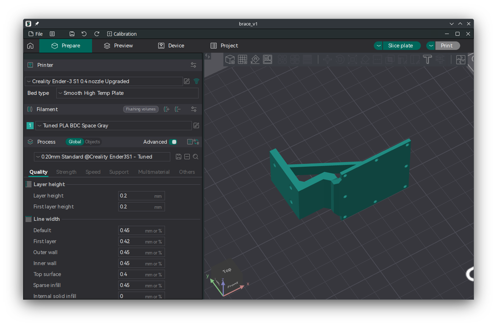
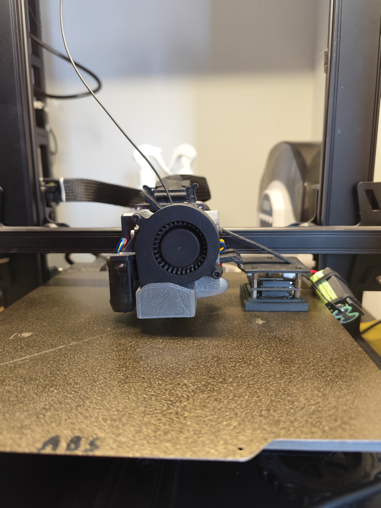
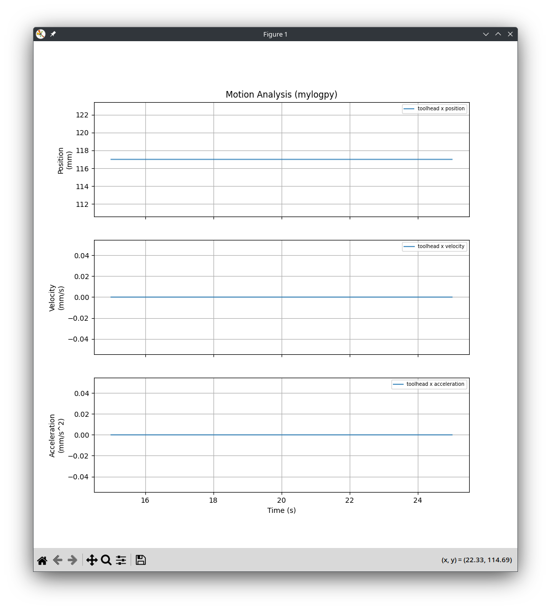

# Progress Update March 21

## Progress
1. Wrote data logger program for device.
2. Testing program using multi-threading to send printer commands, log device motion, and log printer motion.
3. Mount for attaching device to the printer completed.
4. ML algorithm for optimizing Kalman parameters done.



```csv
millis,accel_x,accel_y,accel_z,quat_w,quat_x,quat_y,quat_z,of_x,of_y
18720,0.00363405,0.00022199,-0.00026355,0.02685837,-0.97703755,0.21134564,0.00306347,
18731,0.00534181,0.00128592,0.00207312,0.02684961,-0.97703785,0.21134545,0.00305288,
18733,,,,,,,,0.00000000,0.00000000
18742,-0.00212036,-0.00257664,0.00128833,0.02684428,-0.97703803,0.21134521,0.00304196,
18753,-0.00118988,-0.00326433,0.00309320,0.02685774,-0.97703767,0.21134512,0.00304310,
18763,-0.00364670,0.00420432,0.00155423,0.02686493,-0.97703743,0.21134520,0.00304846,
18773,-0.00047295,0.00134685,0.00127303,0.02686777,-0.97703731,0.21134534,0.00305572,
18783,-0.00086208,0.01062215,0.00577110,0.02684725,-0.97703791,0.21134543,0.00305254,
18793,-0.00712965,0.00865275,0.00509044,0.02683276,-0.97703815,0.21134594,0.00306721,
18804,0.00024224,0.00640157,-0.00086512,0.02680498,-0.97703874,0.21134658,0.00308292,
18815,-0.00581455,-0.00056814,0.00128405,0.02680322,-0.97703862,0.21134701,0.00309908,
18825,-0.00419664,0.00181402,0.00211450,0.02680424,-0.97703850,0.21134731,0.00311164,
18834,,,,,,,,0.00000000,0.00000000
```

## Challenges
1. Printer motion logging doesn't always work, may need to code kinematic model.
2. Still need to fix the above to collect data samples that can be processed to increase the accuracy.
3. Still need to tune covariance matrices for Kalman filter.



## Next Week Work Plan
1. **Write kinematic model for accurate printer motion logging.
2. ***Complete sample data collection.
3. ***Train algorithim and re-test Kalman filter.
4. Finish evaluation and start writing report.